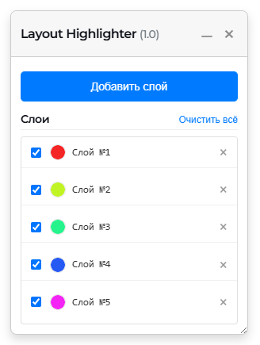
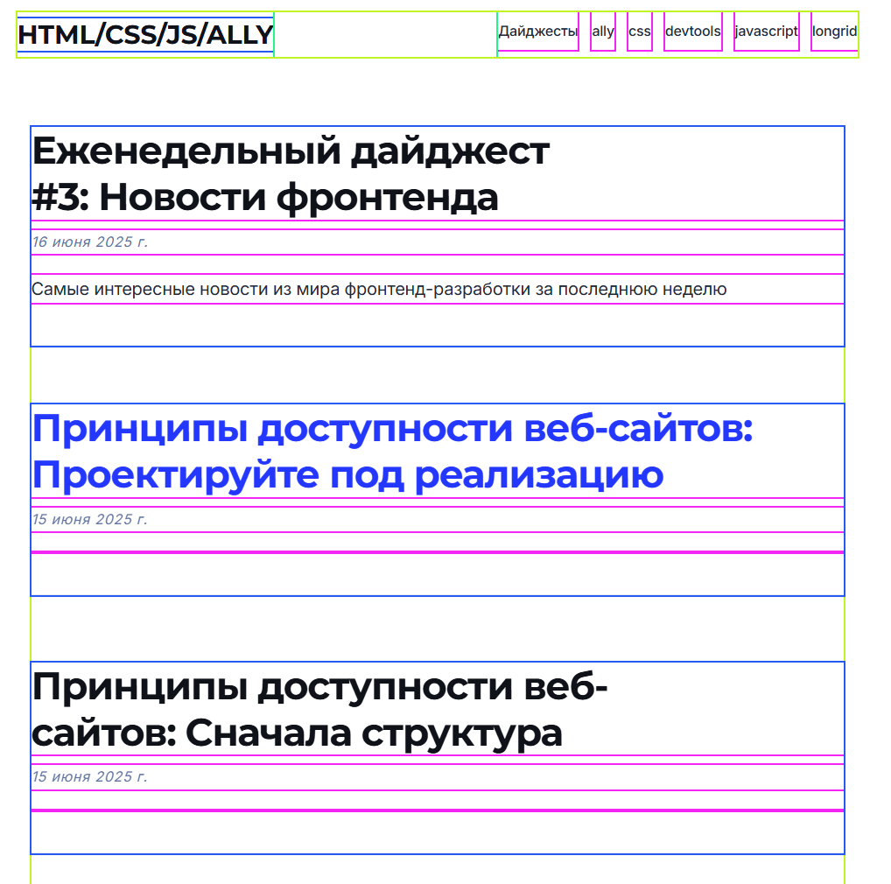

# Layout Highlighter

Простое расширение для браузера, которое помогает визуализировать и отлаживать HTML-разметку страницы, подсвечивая вложенные элементы.

## ✨ Возможности

- **Послойная подсветка:** Добавляйте слои для подсветки элементов на разной глубине вложенности.
- **Управление слоями:**
  - Включайте и отключайте видимость каждого слоя.
  - Удаляйте ненужные слои.
  - Меняйте цвет подсветки для каждого слоя.
- **Удобная панель управления:**
  - **Перетаскивание:** Перемещайте панель в любое место на экране.
  - **Изменение размера:** Меняйте высоту панели по вертикали.
  - **Сворачивание:** Сворачивайте панель, чтобы она не мешала.
- **Быстрые действия:**
  - Кнопка «Добавить слой» для быстрой подсветки.
  - Кнопка «Очистить всё» для удаления всех слоев разом.
- **Сохранение состояния:** Настройки слоев сохраняются между перезагрузками страницы.
- **Динамическая генерация цветов:** Каждый новый слой получает уникальный, хорошо различимый цвет.

## 🚀 Как использовать

1. Нажмите на иконку расширения в панели инструментов браузера, чтобы открыть панель управления.
2. Нажмите кнопку **«Добавить слой»**. На странице подсветится первый уровень элементов внутри `<body>`.
3. Нажимайте «Добавить слой» снова, чтобы подсвечивать более глубокие уровни вложенности.
4. Используйте элементы управления в списке слоев для включения/выключения, изменения цвета или удаления конкретного слоя.
5. Перетаскивайте панель за заголовок, изменяйте ее размер за нижний край или сворачивайте с помощью кнопки «–».
6. Чтобы закрыть панель и сбросить все слои, нажмите на крестик «×».

## 🔧 Установка для разработки

1. Клонируйте репозиторий на свой компьютер.
2. Откройте страницу управления расширениями в вашем браузере (например, `chrome://extensions`).
3. Включите «Режим разработчика».
4. Нажмите «Загрузить распакованное расширение» и выберите папку с проектом. 